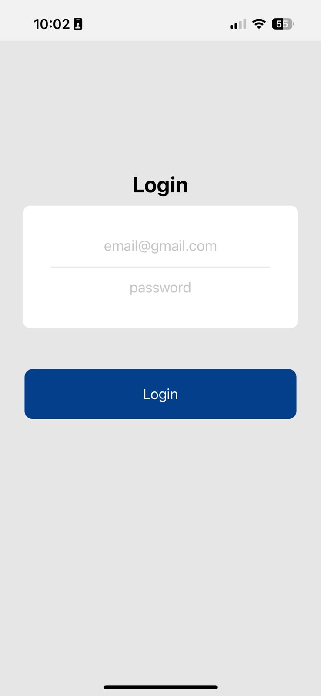

# InvoToGo 
Invotogo is a mobile application build for the purpose of stream lining creation and management of invoices for small scall business.The appliation was build with simplicity to allow business or sole traders to not get tangled up in tech.

The power of React Native which was used to build this application enable it to be cross platform.The application is not live as of now , for early access close then repository into your local computer and run it from there.

## How to run the app locally
Install Expo mobile on your mobile device (IOS or Android)  

Clone the repository  

    git clone https://github.com/McDonaldMusimwa/InvoiceToGo.git 

Run the command to install dependencies  

    npm run install  

Run the command to start the app  

    npm run start

Follow the prompts on the terminal to scan the QR code with your phone.

Screens  

### Onboarding Screen

### Login screen

### Home Screen
 
### View Invoice Screen 

### Invoice Pdf share Screen 
